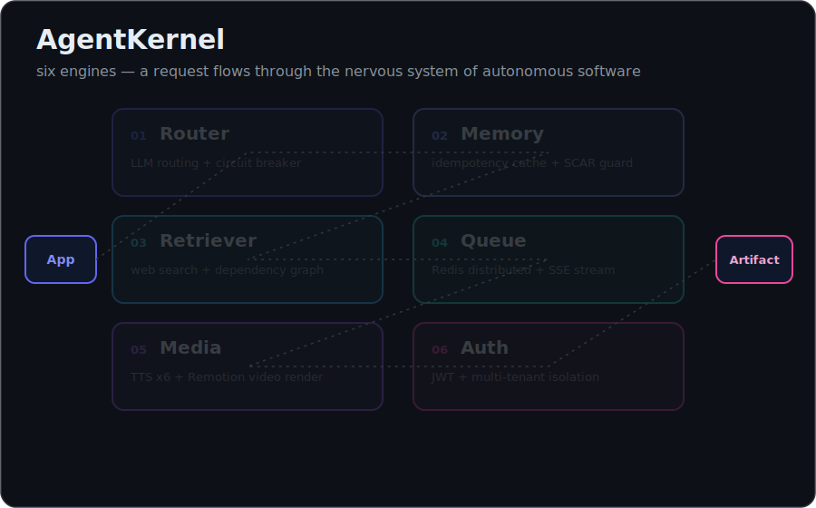
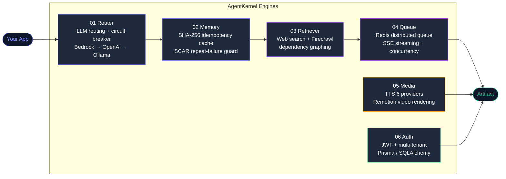
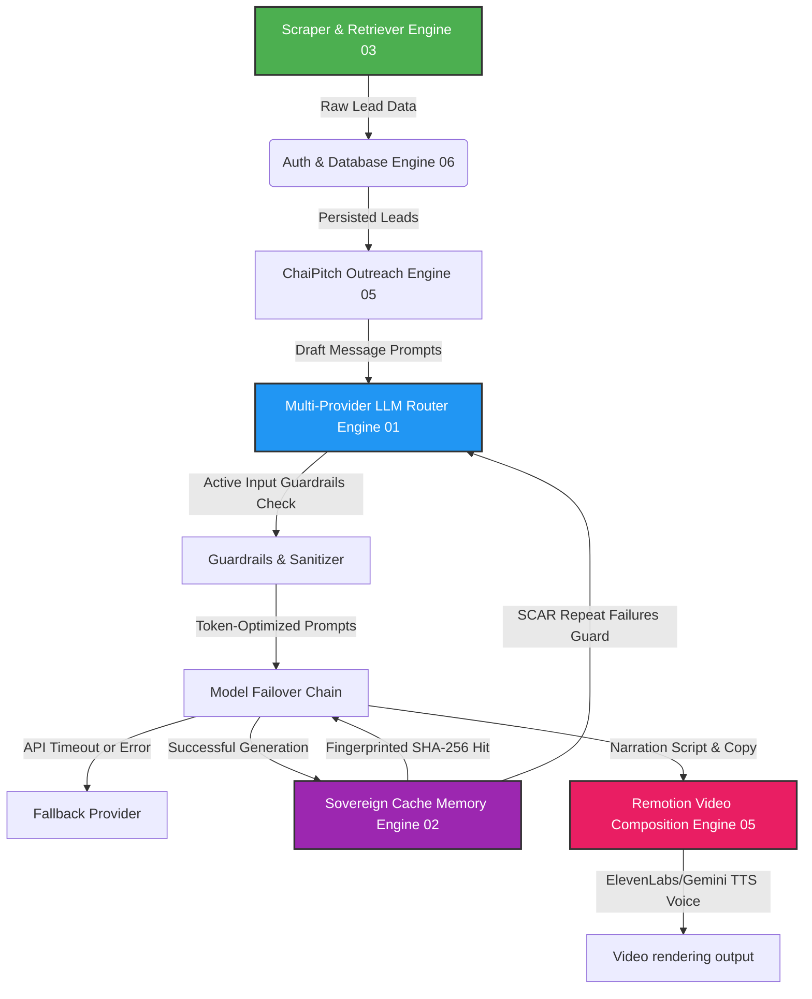

# AgentKernel

> **IMPORTANT**: This repository contains real, production-ready, battle-tested code extracted directly from active commercial systems (like Agency OS or Founder Growth OS), rather than simplified mock learning artifacts.
>
> For project walkthroughs, architecture flowcharts, and system context, visit the live landing page: [my-portfolio-github-io-beta-five.vercel.app/projects/equilibrium.html](https://my-portfolio-github-io-beta-five.vercel.app/projects/equilibrium.html)

[](LICENSE)
[](pyproject.toml)
[](package.json)
[](docker-compose.yml)
[](python/engines/02_memory)
[](esm/engines/05_media)

<div align="center">



</div>

**Building the nervous system of autonomous software.**

AgentKernel is a production-first infrastructure layer for autonomous systems.

It provides the core capabilities required to build reliable AI-powered software:

- Orchestration
- Memory
- Routing
- Execution
- Recovery
- Observability

Most AI frameworks help agents think.

AgentKernel helps autonomous systems operate.

---

## Visual Architecture

**Six engines — how they compose:**



**Architecture reference (all 6 engines annotated):**



**Animated engine map (open in browser):**

The `visual/` folder contains `visual-agentkernel.html` — a standalone animated diagram showing all 6 engines lighting up as a request flows through the stack. No dependencies, no build step.

```
open visual/visual-agentkernel.html
# or: python -m http.server 8080 → localhost:8080/visual/visual-agentkernel.html
```

> Full portfolio case study with live animations: [my-portfolio-github-io-beta-five.vercel.app/projects/equilibrium.html](https://my-portfolio-github-io-beta-five.vercel.app/projects/equilibrium.html)

---

## The Six Engines

AgentKernel is six modular, production-ready engines written in both Async Python and ESM JavaScript. Every engine is independently useful; use one or wire them together.

| Engine | What It Does | Location |
|--------|--------------|----------|
| **01 Router** | Multi-provider LLM routing with circuit breakers, fallover chains, token optimization | `python/engines/01_router/`, `esm/engines/01_router/` |
| **02 Memory** | Sovereign cached memory (SCAR repeat-failure guard, SHA-256 idempotency cache) | `python/engines/02_memory/`, `esm/engines/02_memory/` |
| **03 Retriever** | Web search, Firecrawl scraping, dependency graphing, content analysis | `python/engines/03_retriever/`, `esm/engines/03_retriever/` |
| **04 Queue** | Distributed task queue with circuit breaker, concurrency control, SSE streaming | `python/engines/04_queue/`, `esm/engines/04_queue/` |
| **05 Media** | TTS voice synthesis (6 providers), subtitle generation, story templates | `python/engines/05_media/`, `esm/engines/05_media/` |
| **06 Auth** | JWT auth, multi-tenant database CRUD, Prisma/SQLAlchemy schemas | `python/engines/06_auth/`, `esm/engines/06_auth/` |

---

## 🚀 Get Started (Pick Your Path)

**New to AgentKernel?** Start here. Choose based on what you're building:

### Path A: Single Engine (Just the Router)
**Best for**: Testing LLM routing, learning fallback chains, optimizing tokens
```bash
cd python/engines/01_router
python -m venv venv && source venv/bin/activate
pip install httpx pyjwt
# Edit .env with your API keys (or just use Ollama)
python -c "from router import Router; r = Router(); print('Router ready!')"
```
**Time**: 5 minutes | **Cost**: $0 (if using Ollama)

### Path B: Common Combo (Router + Memory + Retriever)
**Best for**: Building research agents, RAG systems, content analysis pipelines
```bash
cd python
python -m venv venv && source venv/bin/activate
pip install -r requirements.txt
cp .env.example .env
python examples/research-video-assistant/run_assistant.py
```
**Time**: 15 minutes | **Cost**: $0-2 (search API free tier)

### Path C: Full Stack (All 6 Engines)
**Best for**: Production AI apps, outreach automation, end-to-end pipelines
```bash
docker-compose up --build
# Full stack running at http://localhost:8000
# Python API, Redis queue, SQLite, video rendering, auth
```
**Time**: 30 minutes | **Cost**: $0-5 (with Docker, no external APIs)

---

### Vibecoder Problems This Solves

| Your Problem | AgentKernel Solution |
|--------------|---------------------|
| "LLM costs blowing up" | Engine 01: token optimizer saves 20-30%, fallback chains = no vendor lock-in |
| "API goes down = app down" | Every engine has keyless fallback (Ollama, DuckDuckGo, in-memory) |
| "Can't deploy reliably" | Docker-compose.yml provided, runs locally or any cloud |
| "Search APIs are expensive" | Engine 03: $0 DuckDuckGo fallback if paid APIs fail |
| "Don't know how to do video" | Engine 05: Remotion template + TTS, render in minutes |
| "Auth is annoying" | Engine 06: JWT + PBKDF2, zero external deps, just works |
| "Same error keeps happening" | Engine 02: SCAR guard blocks repeated failures |
| "Too many moving parts" | All engines work standalone OR together — pick what you need |

---

## 🛠️ The 6 Core Engines

### 01. Multi-Provider LLM Router & Guardrails
- **Failover Chains**: Automated transitions across OpenAI, Anthropic, Gemini, and local Ollama channels.
- **Model Prompts Styling**: Automatically wraps inputs into XML tags for Gemini, constraints for Moonshot, and concise frames for Nova.
- **Security Checkpoints**: Active input prompt injection blockades and key output redaction streams.

### 02. Sovereign SQLite Memory & SCAR Guard
- **SHA-256 Response Cache**: Automatically avoids duplicate LLM invocation costs.
- **SCAR (Sovereign Critical Action Record)**: Tracks incident errors. If the same fingerprint is detected twice, it injects a warning `STOP` block directly at the top of the prompt payload.

### 03. Scraper & Context Retriever
- **Graphify AST**: Parses folder files recursively, outputting dependency nodes and blast-radius vectors using Python's `ast` package and JS regex parsers.
- **Aggregated Search & Keyless Fallback**: Supports Tavily, SerpAPI, and Brave search channels, falling back to a **keyless DuckDuckGo scraper** if API credentials are missing.
- **Firecrawl Scraper**: Performs structured lead extraction from targets (e.g., IndiaMART product sheets).

### 04. Redis Task Queue, SSE Stream & Circuit Breaker
- **Redis Queue Manager**: Distributed worker heartbeats and priority execution queues, falling back to an **in-memory event queue** when Redis is unavailable.
- **Event Streaming**: Server-Sent Events (SSE) server stream handlers with built-in connection ping pings.
- **Circuit Breaker**: Standalone async circuit breakers to prevent infinite execution loops and cascade network blocks.

### 05. Video-as-Code & Copywriting outreach
- **Universal Remotion template**: Vertically aligned React composition featuring Ken Burns image pan zooms, audio synchronizers, captions overlay, and takeaway moral cards.
- **Voice synthesizers**: Handles ElevenLabs voice synthesis and Gemini prebuilt TTS voices, compiling raw PCM formats into WAV containers.
- **ChaiPitch copywriter**: AI messaging system generating Hinglish WhatsApp pitches for Indian D2C leads.

### 06. Sovereign Auth & SQLite Database
- **Native Security**: Native crypto-based PBKDF2 password hashing and base64 JWT token signatures without external dependencies.
- **Entity CRUD**: Prepared schemas and CRUD operations for Users, Leads, and Outreach messages.

---

## 📂 Repository Directory Layout

```
agentkernel/
├── LICENSE                        ← MIT License
├── README.md                      ← Recruiter overview
├── QUICK_START.md                 ← Fast setup guide
├── ARCHITECTURE.md                ← In-depth design patterns
├── docker-compose.yml             ← Container services
│
├── python/                        ← Python Suite
│   ├── engines/
│   │   ├── 01_router/             ← LLM Router & Guardrails
│   │   ├── 02_memory/             ← Cache & SCAR Guard
│   │   ├── 03_retriever/          ← Graphify & Scrapers
│   │   ├── 04_queue/              ← Redis Queue & Circuit Breakers
│   │   ├── 05_outreach/           ← ChaiPitch copywriter
│   │   └── 06_auth/               ← Database & Hashing
│   ├── pyproject.toml
│   └── requirements.txt
│
└── esm/                           ← ESM JavaScript Suite (ESModules)
    ├── engines/
    │   ├── 01_router/             ← LLM Router & Guardrails
    │   ├── 02_memory/             ← Cache & SCAR Guard
    │   ├── 03_retriever/          ← Graphify & Scrapers
    │   ├── 04_queue/              ← Redis Queue & Circuit Breakers
    │   ├── 05_media/              ← Remotion, Voice, ChaiPitch JS
    │   └── 06_auth/               ← Database & Prisma config
    ├── package.json
    └── tsconfig.json
```

---

## Example: Research Video Assistant

The `examples/research-video-assistant/` folder shows all 6 engines wired together into a single app: scrape leads, store them, generate Hinglish outreach copy, route through the LLM, cache the response, and render a Remotion video with TTS voice.



Run it:
```bash
# Python
python examples/research-video-assistant/run_assistant.py

# JavaScript
node examples/research-video-assistant/run_assistant.js
```
